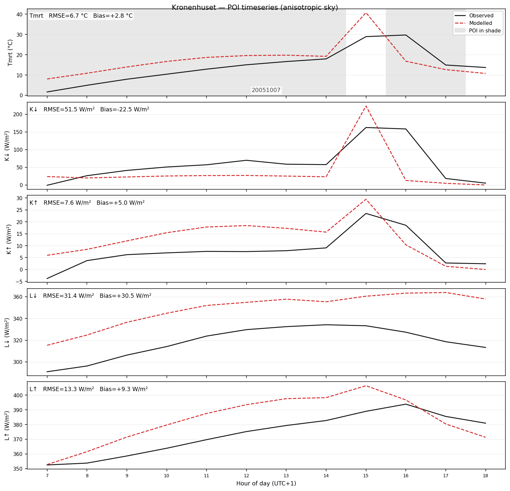
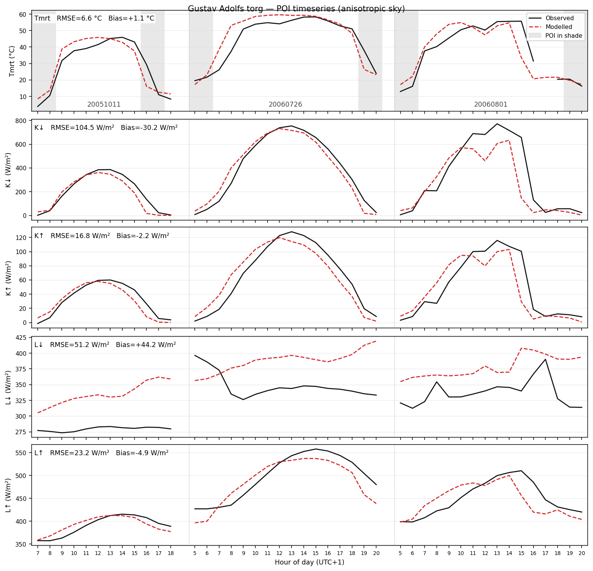
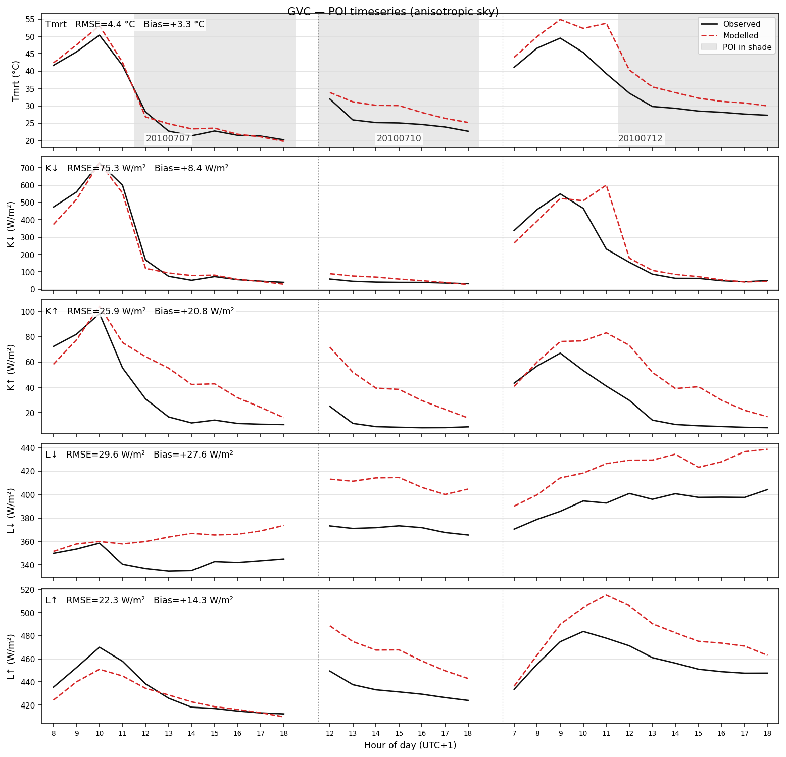

# Validation Report

SOLWEIG is validated against field radiation measurements from three sites in
Gothenburg, Sweden. All validation data — geodata, met files, measurement CSVs,
and POI coordinates (as GeoJSON) — are self-contained under `tests/validation/`
and run automatically in CI on every push and PR.

Each site's POI (point of interest) is loaded at runtime from a `poi.geojson`
file and projected onto the DSM grid. The GeoJSON coordinates were extracted
from the original shapefiles provided with each validation dataset.

Each site section shows observed (solid black) vs modelled (dashed red) Tmrt
and the four radiation components at the POI, stitched across all measurement
days into one continuous timeline. Per-panel RMSE / Bias annotations summarise
agreement. Grey vertical bands on the Tmrt panel mark hours when the modelled
shadow fraction at the POI is < 0.5, so shade-timing mismatches are visible at
a glance.

---

## Summary — v0.1.0b84 (2026-04-16)

| Metric               | Kronenhuset | Gustav Adolfs |          GVC |
| -------------------- | ----------: | ------------: | -----------: |
| Tmrt RMSE range (°C) |         6.7 |       5.7–7.5 |      1.5–6.1 |
| Tmrt R² range        |        0.51 |     0.78–0.87 |    0.79–0.99 |
| Tmrt bias range (°C) |        +2.8 |  -0.4 to +2.4 | +0.9 to +5.2 |
| Days                 |           1 |             3 |            3 |
| Total obs hours      |          12 |            43 |           30 |

---

## Kronenhuset

- **Type:** Enclosed courtyard, central Gothenburg
- **Period:** 2005-10-07 (1 day, 12 daytime hours)
- **Resolution:** 1 m, EPSG:3007
- **POI:** (51, 117) — from `POI_KR.shp` measurement station coordinates
- **Reference:** Lindberg, Holmer & Thorsson (2008)
- **Data:** `tests/validation/kronenhuset/` (DSM, DEM, CDSM, landcover, met, poi.geojson)
- **Notes:** The only site that directly validates individual radiation budget
  components (K↓, K↑, L↓, L↑ and directional fluxes), not just Tmrt.
  Enclosed geometry with ~25 % sky obstruction.



- The POI is in shade for almost the entire day, with one ~2 h sunlit window
  (~13–15 UTC+1). The model amplifies Tmrt and K↓ noticeably more than
  observations during that window, suggesting the modelled shadow boundary
  exits the POI a touch early. This single transition drives most of the
  +2.8 °C Tmrt bias.
- The L↓ panel shows a steady ~+30 W/m² offset across every hour — the
  cool-wall bias is a systematic formulation issue, not sun-position dependent
  (see Known limitations).

---

## Gustav Adolfs torg

- **Type:** Open square, central Gothenburg
- **Period:** 2005-10-11, 2006-07-26, 2006-08-01 (3 days, 43 daytime hours)
- **Resolution:** 2 m, EPSG:3006
- **POI:** (33, 77) — from `test_POI.shp` measurement station coordinates
- **Reference:** Lindberg, Holmer & Thorsson (2008)
- **Data:** `tests/validation/gustav_adolfs/` (DSM, DEM, CDSM, landcover, met, poi.geojson)
- **Notes:** One autumn day (heavily overcast) and two summer days.



- 2005-10-11 (overcast autumn): modelled K↓ greatly exceeds observed (clear-sky
  assumption vs heavy cloud); Tmrt nonetheless tracks observations well because
  the POI is in shade most of the day.
- 2006-07-26 (clear summer): good Tmrt agreement; K↓ tracks closely.
- 2006-08-01 (clear summer): a sharp afternoon K↓ divergence (~600 W/m²
  spike) — most likely partial cloud or a shadow-edge timing offset that the
  hourly met data cannot resolve. This event dominates the day's K↓ RMSE.

---

## GVC (Gothenburg Geoscience Centre)

- **Type:** University campus courtyard, Gothenburg
- **Period:** 2010-07-07, 07-10, 07-12 (3 days, 30 daytime hours)
- **Resolution:** 2 m, EPSG:3006
- **POI:** (51, 122) — from `POI_GVC.shp` Site 1 measurement station coordinates
- **Reference:** Lindberg & Grimmond (2011)
- **Data:** `tests/validation/gvc/` (DSM, DEM, CDSM, landcover, met, poi.geojson)
- **Notes:** Three clear summer days. The POI corresponds to Site 1 from the
  paper. Rasters are labelled `_1m` but are actually 2 m resolution.



- 2010-07-07: clean agreement; the POI transitions into shade after midday and
  modelled Tmrt follows observations closely.
- 2010-07-10: only 7 hours, mostly in shade; modelled Tmrt sits a few °C above
  observed (no abrupt divergence — likely the L↓ cool-wall bias).
- 2010-07-12: large early-afternoon divergence — the model keeps the POI
  sunlit longer than reality, inflating Tmrt by 15–20 °C at the peak. This is
  the dominant driver of the day's +5.2 °C bias.
- The Site 1 measurement station sits at the edge of a dense tree canopy in
  the CDSM (heights of 7–18 m immediately to the west and south), so the
  modelled shadow state is sensitive to sub-pixel canopy position at 2 m
  resolution — the dominant source of day-to-day bias variability at this
  site.

---

## Known limitations

### Kdown at open sites

Point-level downwelling shortwave (Kdown) is sensitive to shadow timing.
At any single pixel the shadow state is binary, so a small shift in the
modelled shadow boundary produces ~600–800 W/m² differences between adjacent
hourly timesteps. The visible spike on Gustav Adolfs 2006-08-01 illustrates
this — a single misaligned hour drives the day's K↓ RMSE up to 157 W/m².
Spatially averaged Kdown would show considerably lower error.

### Ldown overestimation

The model overestimates Ldown at all sites (bias +18 to +55 W/m²). The SOLWEIG
Ldown formulation (Jonsson et al. 2006) fills the non-sky hemisphere with wall
emissions at emissivity 0.90 and air temperature. In practice, shaded walls are
cooler than air temperature, which introduces a positive bias.

- At SVF = 1.0 (open sky), clear-sky Ldown matches observations well.
- The bias increases at sites with lower SVF, where more of the hemisphere is
  filled with wall emissions.
- The Jonsson et al. (2006) empirical correction of −25 W/m² is present but
  commented out in all UMEP releases (2021a, 2022a, 2025a) and is not applied
  here.
- The bias appears as a steady offset across hours (visible in every site's
  L↓ panel), confirming it is formulation-driven rather than sun-position
  dependent.

### Shade-timing sensitivity near vegetation

When the POI sits adjacent to dense canopy or a shadow edge, the modelled
sun/shade state is sensitive to sub-pixel CDSM position at 2 m resolution.
This produces day-by-day bias swings of several °C in Tmrt — most visible at
GVC, where 2010-07-07 has bias +0.9 °C but 2010-07-12 reaches +5.2 °C using
the same site, POI, and surface model.

---

## Comparison with published results

Lindberg et al. (2008) report aggregate statistics over 7 days at two
Gothenburg sites (~189 hours):

| Component |   R² |      RMSE |
| --------- | ---: | --------: |
| Tmrt      | 0.94 |     4.8 K |
| L↓        | 0.73 | 17.5 W/m² |
| L↑        | 0.94 | 15.6 W/m² |

The Tmrt RMSE range from this implementation (1.5–7.5 °C across the seven
day-site combinations) brackets the paper's aggregated 4.8 K. The paper
validates against 1-minute averaged measurements, whereas the met data used
here are hourly, which limits achievable accuracy at sub-hour timescales such
as shadow-edge transitions.

---

## Running validation tests

```bash
# All validation tests (fast data-loading + slow pipeline)
pytest tests/validation/ -m validation

# Just the fast data-loading checks
pytest tests/validation/ -m "validation and not slow"

# A single site
pytest tests/validation/test_validation_gvc.py -v -s

# Per-site time-series plots (regenerates PNGs under <site>/timeseries_plots/)
pytest tests/validation/test_timeseries_plots.py -v -s

# POI sensitivity sweep (regenerates PNGs under <site>/poi_sweep_results/)
pytest tests/validation/test_poi_sweep_all_sites.py -v -s
```

---

## Version history

| Version  | Date       | Sites | Tmrt RMSE range | Key changes                                                                                                                                                                                                                                                                                                                                                                                                                                                                                                                                                                                                                            |
| -------- | ---------- | ----: | --------------: | -------------------------------------------------------------------------------------------------------------------------------------------------------------------------------------------------------------------------------------------------------------------------------------------------------------------------------------------------------------------------------------------------------------------------------------------------------------------------------------------------------------------------------------------------------------------------------------------------------------------------------------- |
| 0.1.0b57 | 2026-03-05 |     3 |     3.4–17.7 °C | Initial 3-site validation. POI sweep analysis added for all sites. Ldown wall-temperature bias documented.                                                                                                                                                                                                                                                                                                                                                                                                                                                                                                                             |
| 0.1.0b58 | 2026-03-06 |     3 |     3.4–17.7 °C | Add validation CI job. Remove non-reproducible Kolumbus/Montpellier tests. Clarify POI sweep documentation.                                                                                                                                                                                                                                                                                                                                                                                                                                                                                                                            |
| 0.1.0b59 | 2026-03-06 |     3 |     4.0–17.7 °C | Move GVC POI to courtyard cluster (70, 126). Shift Kronenhuset POI +1 col to match shadow profile. Move validation report to repo root.                                                                                                                                                                                                                                                                                                                                                                                                                                                                                                |
| 0.1.0b60 | 2026-03-06 |     3 |     4.0–17.7 °C | GPU GVF compute shader (wgpu). Cached thermal accumulation offloaded to GPU with automatic CPU fallback.                                                                                                                                                                                                                                                                                                                                                                                                                                                                                                                               |
| 0.1.0b61 | 2026-03-08 |     3 |     2.4–18.9 °C | Fix file-mode prepare() order (preprocess before walls/SVF), fix tiled wall propagation, fix single-Weather API, fix ModelConfig.from_json() materials, fix QGIS LC override inheritance, fix EPW cross-year timestamps. Ldown RMSE increased due to corrected SVF geometry (absolute heights).                                                                                                                                                                                                                                                                                                                                        |
| 0.1.0b62 | 2026-03-08 |     3 |     2.4–18.9 °C | 35 code review fixes: clearness index, UTC offsets, cache validation, input mutation, dead code, orchestration dedup, lazy imports, PET convergence warning, GPU mutex recovery.                                                                                                                                                                                                                                                                                                                                                                                                                                                       |
| 0.1.0b66 | 2026-03-09 |     3 |     6.0–18.9 °C | Use original measurement station POIs from shapefiles (saved as GeoJSON). GVC POI corrected from (70,126) to (51,122) per POI_GVC.shp. KR rasters moved to self-contained validation folder. All POIs loaded at runtime from poi.geojson via conftest helper.                                                                                                                                                                                                                                                                                                                                                                          |
| 0.1.0b69 | 2026-03-14 |     3 |     6.0–18.9 °C | Fix SVF Options 3/4 zenith patch count (no effect on default Option 2). Fix docs, specs, license refs, CI matrix. Move geopandas to optional. Validation numbers unchanged from b66.                                                                                                                                                                                                                                                                                                                                                                                                                                                   |
| 0.1.0b70 | 2026-03-14 |     3 |     6.0–18.9 °C | Fix sitting posture producing negative Tmrt with anisotropic sky (#9). Add box direct beam splitting. Validation unchanged (standing posture).                                                                                                                                                                                                                                                                                                                                                                                                                                                                                         |
| 0.1.0b71 | 2026-03-14 |     3 |     6.0–18.9 °C | Docs-only: clarify TMY nature of PVGIS downloads in docstrings, user docs, and QGIS plugin (#8). Validation unchanged.                                                                                                                                                                                                                                                                                                                                                                                                                                                                                                                 |
| 0.1.0b72 | 2026-03-17 |     3 |     6.7–17.6 °C | Fix false vegetation shadows on slopes: sub-threshold CDSM/TDSM set to NaN instead of DEM height; underground vegetation cleared. Ldown improved at Kronenhuset (39→32 W/m²) and Gustav Adolfs (84→74 W/m²). Relax SVF veg golden tolerance (known shadowingfunction_20 vs \_23 divergence).                                                                                                                                                                                                                                                                                                                                           |
| 0.1.0b74 | 2026-03-18 |     3 |     6.7–17.6 °C | Fix rasterio resampling pixel drift (from_bounds inexact pixel size). Fix QGIS phantom vegetation (fill_nan overwriting CDSM NaN markers). Add SurfaceData.load(); eliminate QGIS/core duplication. Fix progress bar regression. Validation unchanged from b72.                                                                                                                                                                                                                                                                                                                                                                        |
| 0.1.0b78 | 2026-03-29 |     3 |     6.7–17.6 °C | Fix phantom vegetation in tiled timeseries: tile-extracted surfaces inherit \_nan_filled state, preventing double fill_nan from overwriting intentional CDSM/TDSM NaN markers with DEM values. Also fix tiling buffer overflow on small rasters (core=1 / segfault). Unified tile-outer timeseries architecture. Validation restored to b72 baseline.                                                                                                                                                                                                                                                                                  |
| 0.1.0b81 | 2026-04-08 |     3 |     6.7–17.6 °C | Fix tiled SVF core window overflow when buffer_pixels > tile_size (overlap clamped to actual raster extent). Remove dead Rust code (steradians_for_patch_option, weighted_patch_sum_pure). Validation unchanged from b78.                                                                                                                                                                                                                                                                                                                                                                                                              |
| 0.1.0b82 | 2026-04-11 |     3 |      1.5–7.5 °C | Fix inverted `scale` convention in Rust shadow caster (dz off by `pixel_size²` at non-1 m rasters). Also: DEM stair-step smoothing, `prepare()` warm-run fast-path, tile sizer buffer fix, `GridAccumulator.update()` in-place ufuncs, QGIS metadata consolidation.                                                                                                                                                                                                                                                                                                                                                                    |
| 0.1.0b83 | 2026-04-13 |     3 |      1.5–7.5 °C | Docs-only: correct PVGIS TMY reference period (2005–2020 → 2005–2023 for v5.3) and clarify that TMY row timestamps legitimately span multiple years because each month is a real historical month. Validation unchanged from b82.                                                                                                                                                                                                                                                                                                                                                                                                      |
| 0.1.0b84 | 2026-04-16 |     3 |      1.5–7.5 °C | Rust wall-aspect kernel: promote internal math to f64 and switch to banker's rounding to match numpy/UMEP precision and tie-breaking. Input/output arrays stay f32 — promotion is strictly internal, no change to data-array memory. Delete Python Goodwin fallback so solweig has a single numerical path (QGIS and pip users get identical output). Validation Tmrt numbers shifted by ≤0.13 °C per day (all within thresholds); displayed range unchanged. Plus: 8 new public API exports for plugin/external tools, plugin error wrapping now surfaces SolweigError structured attributes, and ~400 lines of dead helpers removed. |

---

## References

1. Lindberg, F., Holmer, B. & Thorsson, S. (2008). SOLWEIG 1.0 — Modelling
   spatial variations of 3D radiant fluxes and mean radiant temperature in
   complex urban settings. _Int. J. Biometeorol._ 52, 697–713.

2. Lindberg, F. & Grimmond, C.S.B. (2011). The influence of vegetation and
   building morphology on shadow patterns and mean radiant temperature in
   urban areas. _Theor. Appl. Climatol._ 105, 311–323.

3. Jonsson, P., Eliasson, I., Holmer, B. & Grimmond, C.S.B. (2006). Longwave
   incoming radiation in the Tropics: results from field work in three African
   cities. _Theor. Appl. Climatol._ 85, 185–201.
