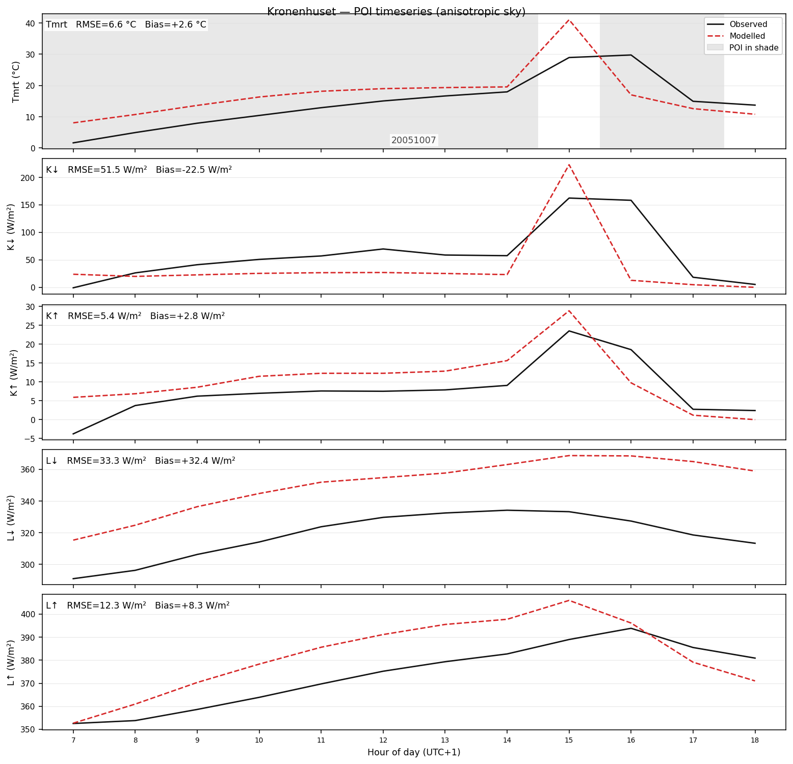
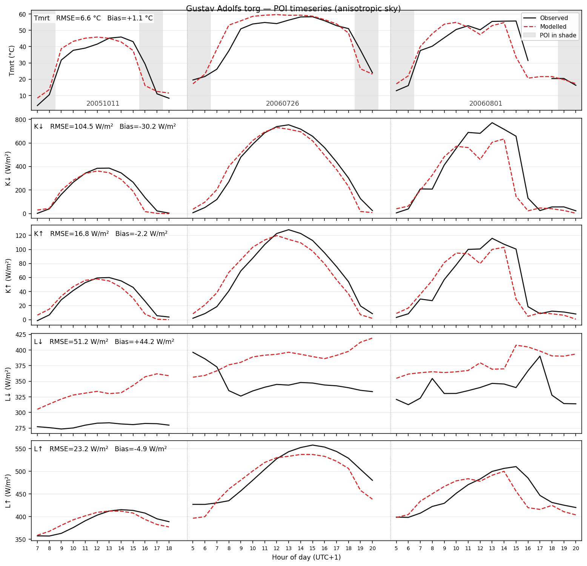
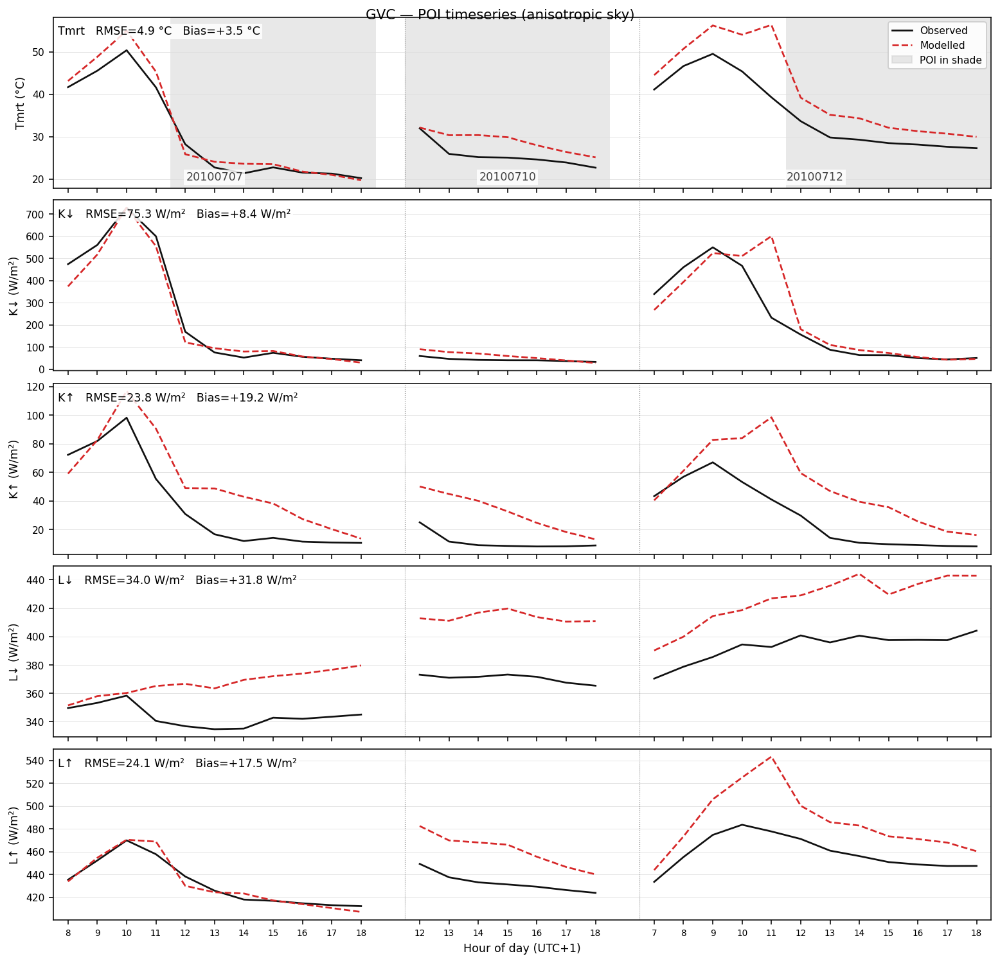

# Validation Report

SOLWEIG is validated against field radiation measurements from three sites in
Gothenburg, Sweden. All validation data (geodata, met files, measurement CSVs,
and POI coordinates as GeoJSON) are self-contained under `tests/validation/`
and run automatically in CI on every push and PR.

Each site's POI (point of interest) is loaded at runtime from a `poi.geojson`
file and projected onto the DSM grid. The GeoJSON coordinates were extracted
from the original shapefiles provided with each validation dataset.

Each site section shows observed (solid black) vs modelled (dashed red) Tmrt
and the four radiation components at the POI, stitched across all measurement
days into one continuous timeline. Per-panel RMSE / Bias annotations summarise
agreement. Grey vertical bands on the Tmrt panel mark hours when the modelled
shadow fraction at the POI is < 0.5, so shade-timing mismatches are visible at
a glance.

---

## Summary — v0.1.0b95 (2026-08-25)

Baseline numbers are identical to b89. b90 added the opt-in 2026a ground
scheme with defaults off. b91 reduced large-raster memory use. b93 to
b95 are bug-fix releases with no numerical change (b93: QGIS plugin
metadata parse failure, stale-SVF-cache detection; b94: SOLWEIG_NO_GPU
honoured on the precomputed-SVF path, plugin EPW assert guard, docs
positioning; b95: plugin Qt6 enum fix). b92 was performance and GPU-utilisation work: async and overlapped I/O (tiled writes,
next-tile read-ahead, memory-bounded parallel summary export), a night-shadow
skip, an empty-tile compute skip, and the GVF geometry precompute moved onto
the GPU (computed once into resident buffers and reused across a tile's
timesteps). Validation is unchanged (31/31 pass, Tmrt RMSE 2.4 to 7.3 °C). GPU
and CPU Tmrt match exactly; the only output change is shadow over fully-nodata
tiles, now NaN instead of a spurious sunlit 1.0. The opt-in scheme has its own
field comparison further down.

| Metric               | Kronenhuset | Gustav Adolfs |          GVC |
| -------------------- | ----------: | ------------: | -----------: |
| Tmrt RMSE range (°C) |         6.6 |       5.7–7.3 |      2.4–6.9 |
| Tmrt R² range        |        0.52 |     0.80–0.88 |    0.65–0.99 |
| Tmrt bias range (°C) |        +2.6 |  +0.6 to +3.7 | +1.4 to +5.8 |
| Days                 |           1 |             3 |            3 |
| Total obs hours      |          12 |            43 |           30 |

> **Read this before interpreting the radiation panels.** Modelled L↓ sits
> 18 to 55 W/m² above the observations at every site. This traces to the
> published Ldown formulation rather than to calibration; see
> [§ Ldown positive bias](#ldown-positive-bias) below. K↓ at open sites is
> shadow-edge-sensitive and can spike on a single mis-aligned hour; see
> [§ Kdown at open sites](#kdown-at-open-sites).

---

## Kronenhuset

- **Type:** Enclosed courtyard, central Gothenburg
- **Period:** 2005-10-07 (1 day, 12 daytime hours)
- **Resolution:** 1 m, EPSG:3007
- **POI:** (51, 117), from `POI_KR.shp` measurement station coordinates
- **Reference:** Lindberg, Holmer & Thorsson (2008)
- **Data:** `tests/validation/kronenhuset/` (DSM, DEM, CDSM, landcover, met, poi.geojson)
- **Notes:** The only site that directly validates individual radiation budget
  components (K↓, K↑, L↓, L↑ and directional fluxes), not just Tmrt.
  Enclosed geometry with ~25 % sky obstruction.



- The POI is in shade for almost the entire day, with one ~2 h sunlit window
  (~13–15 UTC+1). The model amplifies Tmrt and K↓ noticeably more than
  observations during that window, suggesting the modelled shadow boundary
  exits the POI a touch early. This single transition drives most of the
  +2.8 °C Tmrt bias.
- The L↓ panel shows a steady ~+30 W/m² offset across every hour. The
  cool-wall bias is systematic and independent of sun position (see Known
  limitations).

---

## Gustav Adolfs torg

- **Type:** Open square, central Gothenburg
- **Period:** 2005-10-11, 2006-07-26, 2006-08-01 (3 days, 43 daytime hours)
- **Resolution:** 2 m, EPSG:3006
- **POI:** (33, 77), from `test_POI.shp` measurement station coordinates
- **Reference:** Lindberg, Holmer & Thorsson (2008)
- **Data:** `tests/validation/gustav_adolfs/` (DSM, DEM, CDSM, landcover, met, poi.geojson)
- **Notes:** One autumn day (heavily overcast) and two summer days.



- 2005-10-11 (overcast autumn): modelled K↓ greatly exceeds observed (clear-sky
  assumption vs heavy cloud); Tmrt nonetheless tracks observations well because
  the POI is in shade most of the day.
- 2006-07-26 (clear summer): good Tmrt agreement; K↓ tracks closely.
- 2006-08-01 (clear summer): a sharp afternoon K↓ divergence (~600 W/m²
  spike), most likely partial cloud or a shadow-edge timing offset that the
  hourly met data cannot resolve. This event dominates the day's K↓ RMSE.

---

## GVC (Gothenburg Geoscience Centre)

- **Type:** University campus courtyard, Gothenburg
- **Period:** 2010-07-07, 07-10, 07-12 (3 days, 30 daytime hours)
- **Resolution:** 2 m, EPSG:3006
- **POI:** (51, 122), from `POI_GVC.shp` Site 1 measurement station coordinates
- **Reference:** Lindberg & Grimmond (2011)
- **Data:** `tests/validation/gvc/` (DSM, DEM, CDSM, landcover, met, poi.geojson)
- **Notes:** Three clear summer days. The POI corresponds to Site 1 from the
  paper. Rasters are labelled `_1m` but are actually 2 m resolution.



- 2010-07-07: clean agreement; the POI transitions into shade after midday and
  modelled Tmrt follows observations closely.
- 2010-07-10: only 7 hours, mostly in shade; modelled Tmrt sits a few °C above
  observed (no abrupt divergence; likely the L↓ cool-wall bias).
- 2010-07-12: large early-afternoon divergence. The model keeps the POI
  sunlit longer than reality, raising Tmrt by 15–20 °C at the peak. This is
  the dominant driver of the day's +5.2 °C bias.
- The Site 1 measurement station sits at the edge of a dense tree canopy in
  the CDSM (heights of 7–18 m immediately to the west and south), so the
  modelled shadow state is sensitive to sub-pixel canopy position at 2 m
  resolution. This is the dominant source of day-to-day bias variability at
  this site.

---

## Known limitations

### Kdown at open sites

Point-level downwelling shortwave (Kdown) is sensitive to shadow timing.
At any single pixel the shadow state is binary, so a small shift in the
modelled shadow boundary produces ~600–800 W/m² differences between adjacent
hourly timesteps. The visible spike on Gustav Adolfs 2006-08-01 illustrates
this: a single misaligned hour drives the day's K↓ RMSE up to 157 W/m².
Spatially averaged Kdown would show considerably lower error.

### Ldown positive bias

Modelled Ldown exceeds the observations at all sites (bias +18 to +55 W/m²).
The SOLWEIG Ldown formulation (Jonsson et al. 2006) fills the non-sky
hemisphere with wall emissions at emissivity 0.90 and air temperature. In
practice, shaded walls are cooler than air temperature, which introduces a
positive bias.

- At SVF = 1.0 (open sky), clear-sky Ldown matches observations well.
- The bias increases at sites with lower SVF, where more of the hemisphere is
  filled with wall emissions.
- The Jonsson et al. (2006) empirical correction of −25 W/m² is present but
  commented out in all UMEP releases (2021a, 2022a, 2025a) and is not applied
  here.
- The bias appears as a steady offset across hours (visible in every site's
  L↓ panel), confirming it is formulation-driven rather than sun-position
  dependent.

### Shade-timing sensitivity near vegetation

When the POI sits adjacent to dense canopy or a shadow edge, the modelled
sun/shade state is sensitive to sub-pixel CDSM position at 2 m resolution.
This produces day-by-day bias swings of several °C in Tmrt, most visible at
GVC, where 2010-07-07 has bias +0.9 °C but 2010-07-12 reaches +5.2 °C using
the same site, POI, and surface model.

---

## UMEP 2026a ground scheme (opt-in): field comparison

Run 2026-07-07 on the same three sites, anisotropic sky, with
`use_ground_scheme=True` / `use_outgoing_longwave=True` (site parameter
files extended with the bundled OHM/heat-capacity blocks, which the legacy
site JSONs predate). POI Tmrt against measurements:

| Site | Day | Baseline RMSE / bias (°C) | Scheme RMSE / bias (°C) |
| --- | --- | --- | --- |
| Kronenhuset | 2005-10-07 | 6.6 / +2.6 | 22.0 / +21.4 |
| Gustav Adolfs | 2005-10-11 | 5.7 / +1.5 | 13.6 / +12.7 |
| Gustav Adolfs | 2006-07-26 | 7.1 / +3.7 | 16.4 / +15.8 |
| Gustav Adolfs | 2006-08-01 | 7.3 / +0.6 | 15.1 / +13.6 |
| GVC | 2010-07-07 | 4.4 / −1.4 | 12.9 / +12.5 |
| GVC | 2010-07-10 | 6.0 / +2.9 | 17.3 / +16.3 |
| GVC | 2010-07-12 | 8.6 / +7.9 | 21.1 / +20.8 |

The bias is consistently positive. The flux decomposition localises it:
Kdown, Kup and Ldown are essentially unchanged, and the scheme's Lup at the
Kronenhuset POI is closer to the observations than the baseline (bias +0.3
vs +8.3 W/m²), so the force-restore ground temperature itself appears sound.
The excess enters through the directional and cylinder Lside composition of
`Solweig_2026a_calc`: the solid-angle march's directional side longwave
feeds the Fside term, and in anisotropic mode the 2026a code additionally
adds the mean of those directional terms to the Fcyl term (2025a used only
the anisotropic-sky Lside there). An isotropic diagnostic at Kronenhuset
separates the two contributions: RMSE 8.9 / bias +7.2 °C (baseline 5.8 /
+0.9), so roughly a third of the anisotropic-mode bias remains without the
Fcyl addition.

Consequences:

- `use_ground_scheme` / `use_outgoing_longwave` stay off by default. Until
  the composition question is settled upstream, scheme output is best
  treated as qualitative.
- A question about the composition is open with the upstream developers
  (raised 2026-07-07 alongside the other findings from this port).
- The port itself is faithful: every component matches the vendored
  upstream reference (`tests/spec/test_parity_2026a.py`), and an
  end-to-end check running upstream's own `Solweig_2026a_calc` (vendored
  Python) against the fused Rust path on identical inputs agrees to
  within 0.08 °C Tmrt for 22 of 24 hours of a full diurnal cycle (the
  two exceptions are sunrise/sunset transition hours where the drivers'
  clearness-index handling legitimately differs). These numbers therefore
  characterise the upstream scheme as published, not the port.

---

## Comparison with published results

Lindberg et al. (2008) report aggregate statistics over 7 days at two
Gothenburg sites (~189 hours):

| Component |   R² |      RMSE |
| --------- | ---: | --------: |
| Tmrt      | 0.94 |     4.8 K |
| L↓        | 0.73 | 17.5 W/m² |
| L↑        | 0.94 | 15.6 W/m² |

The Tmrt RMSE range from this implementation (1.5–7.5 °C across the seven
day-site combinations) brackets the paper's aggregated 4.8 K. The paper
validates against 1-minute averaged measurements, whereas the met data used
here are hourly, which limits achievable accuracy at sub-hour timescales such
as shadow-edge transitions.

---

## Running validation tests

```bash
# All validation tests (fast data-loading + slow pipeline)
pytest tests/validation/ -m validation

# Just the fast data-loading checks
pytest tests/validation/ -m "validation and not slow"

# A single site
pytest tests/validation/test_validation_gvc.py -v -s

# Per-site time-series plots (regenerates PNGs under <site>/timeseries_plots/)
pytest tests/validation/test_timeseries_plots.py -v -s

# POI sensitivity sweep (regenerates PNGs under <site>/poi_sweep_results/)
pytest tests/validation/test_poi_sweep_all_sites.py -v -s
```

---

## Version history

| Version  | Date       | Sites | Tmrt RMSE range | Key changes                                                                                                                                                                                                                                                                                                                                                                                                                                                                                                                                                                                                                            |
| -------- | ---------- | ----: | --------------: | -------------------------------------------------------------------------------------------------------------------------------------------------------------------------------------------------------------------------------------------------------------------------------------------------------------------------------------------------------------------------------------------------------------------------------------------------------------------------------------------------------------------------------------------------------------------------------------------------------------------------------------- |
| 0.1.0b57 | 2026-03-05 |     3 |     3.4–17.7 °C | Initial 3-site validation. POI sweep analysis added for all sites. Ldown wall-temperature bias documented.                                                                                                                                                                                                                                                                                                                                                                                                                                                                                                                             |
| 0.1.0b58 | 2026-03-06 |     3 |     3.4–17.7 °C | Add validation CI job. Remove non-reproducible Kolumbus/Montpellier tests. Clarify POI sweep documentation.                                                                                                                                                                                                                                                                                                                                                                                                                                                                                                                            |
| 0.1.0b59 | 2026-03-06 |     3 |     4.0–17.7 °C | Move GVC POI to courtyard cluster (70, 126). Shift Kronenhuset POI +1 col to match shadow profile. Move validation report to repo root.                                                                                                                                                                                                                                                                                                                                                                                                                                                                                                |
| 0.1.0b60 | 2026-03-06 |     3 |     4.0–17.7 °C | GPU GVF compute shader (wgpu). Cached thermal accumulation offloaded to GPU with automatic CPU fallback.                                                                                                                                                                                                                                                                                                                                                                                                                                                                                                                               |
| 0.1.0b61 | 2026-03-08 |     3 |     2.4–18.9 °C | Fix file-mode prepare() order (preprocess before walls/SVF), fix tiled wall propagation, fix single-Weather API, fix ModelConfig.from_json() materials, fix QGIS LC override inheritance, fix EPW cross-year timestamps. Ldown RMSE increased due to corrected SVF geometry (absolute heights).                                                                                                                                                                                                                                                                                                                                        |
| 0.1.0b62 | 2026-03-08 |     3 |     2.4–18.9 °C | 35 code review fixes: clearness index, UTC offsets, cache validation, input mutation, dead code, orchestration dedup, lazy imports, PET convergence warning, GPU mutex recovery.                                                                                                                                                                                                                                                                                                                                                                                                                                                       |
| 0.1.0b66 | 2026-03-09 |     3 |     6.0–18.9 °C | Use original measurement station POIs from shapefiles (saved as GeoJSON). GVC POI corrected from (70,126) to (51,122) per POI_GVC.shp. KR rasters moved to self-contained validation folder. All POIs loaded at runtime from poi.geojson via conftest helper.                                                                                                                                                                                                                                                                                                                                                                          |
| 0.1.0b69 | 2026-03-14 |     3 |     6.0–18.9 °C | Fix SVF Options 3/4 zenith patch count (no effect on default Option 2). Fix docs, specs, license refs, CI matrix. Move geopandas to optional. Validation numbers unchanged from b66.                                                                                                                                                                                                                                                                                                                                                                                                                                                   |
| 0.1.0b70 | 2026-03-14 |     3 |     6.0–18.9 °C | Fix sitting posture producing negative Tmrt with anisotropic sky (#9). Add box direct beam splitting. Validation unchanged (standing posture).                                                                                                                                                                                                                                                                                                                                                                                                                                                                                         |
| 0.1.0b71 | 2026-03-14 |     3 |     6.0–18.9 °C | Docs-only: clarify TMY nature of PVGIS downloads in docstrings, user docs, and QGIS plugin (#8). Validation unchanged.                                                                                                                                                                                                                                                                                                                                                                                                                                                                                                                 |
| 0.1.0b72 | 2026-03-17 |     3 |     6.7–17.6 °C | Fix false vegetation shadows on slopes: sub-threshold CDSM/TDSM set to NaN instead of DEM height; underground vegetation cleared. Ldown improved at Kronenhuset (39→32 W/m²) and Gustav Adolfs (84→74 W/m²). Relax SVF veg golden tolerance (known shadowingfunction_20 vs \_23 divergence).                                                                                                                                                                                                                                                                                                                                           |
| 0.1.0b74 | 2026-03-18 |     3 |     6.7–17.6 °C | Fix rasterio resampling pixel drift (from_bounds inexact pixel size). Fix QGIS phantom vegetation (fill_nan overwriting CDSM NaN markers). Add SurfaceData.load(); eliminate QGIS/core duplication. Fix progress bar regression. Validation unchanged from b72.                                                                                                                                                                                                                                                                                                                                                                        |
| 0.1.0b78 | 2026-03-29 |     3 |     6.7–17.6 °C | Fix phantom vegetation in tiled timeseries: tile-extracted surfaces inherit \_nan_filled state, preventing double fill_nan from overwriting intentional CDSM/TDSM NaN markers with DEM values. Also fix tiling buffer overflow on small rasters (core=1 / segfault). Unified tile-outer timeseries architecture. Validation restored to b72 baseline.                                                                                                                                                                                                                                                                                  |
| 0.1.0b81 | 2026-04-08 |     3 |     6.7–17.6 °C | Fix tiled SVF core window overflow when buffer_pixels > tile_size (overlap clamped to actual raster extent). Remove dead Rust code (steradians_for_patch_option, weighted_patch_sum_pure). Validation unchanged from b78.                                                                                                                                                                                                                                                                                                                                                                                                              |
| 0.1.0b82 | 2026-04-11 |     3 |      1.5–7.5 °C | Fix inverted `scale` convention in Rust shadow caster (dz off by `pixel_size²` at non-1 m rasters). Also: DEM stair-step smoothing, `prepare()` warm-run fast-path, tile sizer buffer fix, `GridAccumulator.update()` in-place ufuncs, QGIS metadata consolidation.                                                                                                                                                                                                                                                                                                                                                                    |
| 0.1.0b83 | 2026-04-13 |     3 |      1.5–7.5 °C | Docs-only: correct PVGIS TMY reference period (2005–2020 → 2005–2023 for v5.3) and clarify that TMY row timestamps legitimately span multiple years because each month is a real historical month. Validation unchanged from b82.                                                                                                                                                                                                                                                                                                                                                                                                      |
| 0.1.0b84 | 2026-04-16 |     3 |      1.5–7.5 °C | Rust wall-aspect kernel: promote internal math to f64 and switch to banker's rounding to match numpy/UMEP precision and tie-breaking. Input/output arrays stay f32 — promotion is strictly internal, no change to data-array memory. Delete Python Goodwin fallback so solweig has a single numerical path (QGIS and pip users get identical output). Validation Tmrt numbers shifted by ≤0.13 °C per day (all within thresholds); displayed range unchanged. Plus: 8 new public API exports for plugin/external tools, plugin error wrapping now surfaces SolweigError structured attributes, and ~400 lines of dead helpers removed. |
| 0.1.0b85 | 2026-05-26 |     3 |      1.5–7.5 °C | Architecture stabilisation pass — **zero numerical change, byte-identical golden output**. (1) Rust FFI bundling: 17 SVF arrays → `SvfBundle`, 9 thermal-state fields → `StateBundle` with FFI-version field that fails fast on mismatch. `compute_timestep` signature drops from 43 → 18 args. (2) Surface views (`surface.geometry` / `.optical` / `.auxiliary`) now load-bearing in the production path. (3) Cache-key hardening: `_arr_key` adds witness bytes from first/middle/last element, catching in-place mutations the old `(ctypes.data, shape)` key missed. (4) `Settings` dataclass replaces the 50-line override block. (5) Geospatial helpers moved to `solweig.geospatial` submodule; top-level re-exports emit `DeprecationWarning`. (6) Audit script wired (`poe audit` → `AUDIT.md`); CI gains an `audit` job and the `test-spec` job now includes slow tests. (7) `vegetation.rs` panic surface 44 → 14 via documented `expect()` helper. (8) `surface.py` shrinks 3037 → 2944 (serialization helpers extracted). |
| 0.1.0b86 | 2026-05-27 |     3 |      1.5–7.5 °C | Internal tidy-and-tighten — **zero numerical change, byte-identical golden output**. (1) Hot-file decomposition continued: `surface.py` 3037 → 1731 (extracted `surface_loading`, `surface_compute`, `surface_svf_tiled`); `io.py` 1259 → 678 (`io_epw` + `io_preview`); `summary.py` 935 → 493 (`grid_accumulator`); `models/weather.py` 848 → 642 (`models/location`); `models/precomputed.py` 804 → 560 (`models/shadow_arrays`). (2) Test coverage 75% → 81% via +117 focused unit tests. (3) `solweig.Settings` + `solweig.ThermalState` promoted to top-level public surface. (4) Plugin: 349 LOC of dead `create_surface_from_parameters` chain removed; metadata changelog trimmed 254 → 96 lines. (5) Public docs: physics specs rendered in-site via `mkdocs-include-markdown`; dev docs (`PRINCIPLES.md`, `INVARIANTS.md`, `ARCHITECTURE.md`) moved to repo root; tutorial notebooks gain proper alt text via custom mkdocs hook. (6) Audit script gains `axis_canonical_docs` (9th axis) — guards against repo-root doc drift. (7) Performance gates tightened ~3–10× (matrix budgets 1.5–4.0 s → 0.5–0.85 s; ratio caps 5/4/6 → 2/2.5/2). (8) Memory benchmark re-measured at 377 B/px (Feb baseline 370; refactors added under 2%).                                                                                                                                                                                                                                                                                                                                                                                                                                                                                                |
| 0.1.0b87 | 2026-05-27 |     3 |      1.5–7.5 °C | GPU/CPU surface improvements + deprecation removal — **zero numerical change, byte-identical golden output**. (1) **Breaking:** top-level geospatial helpers (b85→b86 `DeprecationWarning` shim) removed — import from `solweig.geospatial` instead; old names now raise `AttributeError`. (2) `solweig.disable_gpu()` now toggles all three GPU paths (shadows + aniso + GVF) in a single call; pre-b87 it only flipped shadows so "CPU-only" runs weren't actually CPU-only. (3) New `solweig.enable_gpu()`. (4) Fixed a lazy-init bug where `is_gpu_available()` silently re-enabled GPU after `disable_gpu()`. (5) GPU metrics surface: `gpu_dispatch_count()` / `gpu_fallback_count()` / `reset_gpu_metrics()` — thread-safe atomic counters incremented at every GPU dispatch / fallback site. Lets tests assert "GPU path actually ran". (6) New shadow + SVF GPU/CPU parity tests (`tests/spec/test_gpu_cpu_parity.py`); documents a small known difference at canopy-edge `svf_veg*` pixels — building/aveg SVF byte-identical; veg drift up to 0.042 in <1% of pixels, propagates to <0.5 °C Tmrt. (7) New GPU/CPU runtime-ratio benchmark — appends to `tests/benchmarks/logs/gpu_cpu_ratio_history.md`. (8) Corrected outdated CLAUDE.md "GPU context recreated per call" claim — contexts are cached via `OnceLock`; only buffers reallocate per shape change. |
| 0.1.0b88 | 2026-05-27 |     3 |      1.5–7.5 °C | Internal-only release — no code, plugin, runtime, or numerical change. Moves timing-based benchmarks off CI to a local-only `gpu_perf_gate` marker; CI keeps the hardware-stable memory bench. Validation 31/31 pass, unchanged from b82 baseline. |
| 0.1.0b89 | 2026-07-06 |     3 |      1.5–7.4 °C | Pre-bump correctness sweep. (1) **Pressure unit fix in `clearnessindex_2013b`**: `Weather.pressure` is hPa but the function applied classic UMEP's kPa→mb ×10, driving p to ~10 000 mb and underestimating clear-sky I0 by ~20–25 % (743 vs 916 W/m² at 30° zenith); CI now crosses the <0.95 Ldown cloud-correction threshold correctly. Validation shifts are small because all three sites use measured direct/diffuse radiation (CI affects only the Ldown correction): Kronenhuset unchanged (6.7/0.51), Gustav Adolfs slightly improved (5.6–7.4 °C, R² 0.79–0.88), GVC 1.5–6.2 °C, R² 0.80–0.99. New spec gate `tests/spec/test_clearness_index.py`. (2) **Per-field EPW missing codes**: the shared `na_values` set nulled legitimate data (RH 99 %, GHI/DNI/DHI 999 W/m²) and missed real sentinels (dry-bulb 99.9, pressure 999999 Pa); no numerical change for bundled or validation datasets (scanned: no affected values). `from_epw` default now loads the whole first day as documented, not just the first timestep. (3) **Tiled SVF path fixed** (runtime NameError) and cancellation now raises `ComputationCancelled` instead of persisting partial SVF caches (untouched tiles at SVF=1.0) or writing the prepare fingerprint without SVF. (4) `ModelConfig.from_json` reads the legacy `Value` nesting (user parameter files were silently ignored); no change at defaults. (5) **GVF source-area march fixed at non-1 m pixels**: the metres→pixels conversion multiplied by pixel size where UMEP divides (`gvf_geometry.rs`, `sun.rs`), so at 2 m pixels the Smidt et al. source area marched 144 m instead of 36 m (and at 0.5 m only 9 m); at coarse pixels the over-long march could also panic on small rasters (march now clamped to the raster extent). New parity gate `tests/spec/test_gvf_pixel_scale_parity.py` pins GVF against UMEP's `gvf_2018a` at 0.5/1/2 m. Kronenhuset (1 m) byte-identical; the 2 m sites now reproduce what UMEP itself computes: Gustav Adolfs 5.7–7.3 °C (R² 0.80–0.88), GVC 2.4–6.9 °C (R² 0.65–0.99) — mixed movement vs the pre-fix numbers, which had benefited from the unphysically long source-area averaging. (6) **Cached GVF sunwall mask unified with UMEP semantics** (fully sunlit walls only, matching `gvf_2018a`; the per-timestep cached path previously counted any partially sunlit wall): Kronenhuset improves to 6.6 °C RMSE / R² 0.52 / bias +2.6; the 2 m sites shift ≤0.03 °C. Final b89 validation: 25/25 pass, Tmrt RMSE 2.4–7.3 °C across the seven site-days. |
| 0.1.0b90 | 2026-07-07 |     3 |      2.4–7.3 °C | UMEP 2026a ground-surface scheme wired into the fused pipeline behind the opt-in `use_ground_scheme` / `use_outgoing_longwave` flags (force-restore/OHM surface temperature + solid-angle outgoing longwave march + `Lside_veg_v2026`, ordering per upstream `Solweig_2026a_calc`). Defaults off: baseline physics unchanged, golden output byte-identical, validation 31/31 pass with numbers identical to b89. Scheme components parity-gated against the vendored upstream reference (`tests/spec/test_parity_2026a.py`). The scheme requires a land-cover grid and currently rejects tiled processing. A field comparison of the opt-in scheme (see "UMEP 2026a ground scheme: field comparison") found Tmrt substantially above the observations (RMSE 12.9–22.0 °C, bias +12.5 to +21.4 °C over seven site-days); a question about the radiation composition is open with the upstream developers and the defaults stay off. |
| 0.1.0b91 | 2026-07-08 |     3 |      2.4–7.3 °C | Large-raster memory reductions — **zero numerical change, output byte-identical**. (a) Base-layer load/align in `prepare()` processes one layer at a time through disk-backed memmaps instead of holding the full layer stack as resident RAM. (b) `findwalls` uses pairwise `np.maximum` instead of `np.maximum.reduce([4 slices])`, removing an ~8 GB whole-raster stack temporary (the largest hard-RAM spike). (c) The tiled-SVF output memmaps and the tiled-calc summary memmaps drop their blanket whole-array pre-fill (`mm[:]=1.0` / `arr[:]=nan/0`) and flush per tile; the tile write_slices partition the raster so every pixel is written, making this byte-identical. Measured cold Madrid (507 Mpx, isotropic): prepare peak 35.6 → 27.3 GB, overall peak RSS 38.1 → 32.9 GB. Verified bit-for-bit at 507 Mpx (6 cleaned layers, 15 SVF arrays, 3 shadow matrices) and via `tests/test_preprocess_streaming.py::test_large_sequential_path_matches_small`. Also fixes a latent macOS hazard: `np.save` over a live memmap (missed because `np.asarray(memmap)` yields a plain-ndarray view) could wedge the process; disk-backed layers now detected via `_backing_memmap()`. Golden + validation unchanged from b90 (31/31 pass); full suite 1166 passed. Note: this work surfaced a pre-existing, benign tile-size sensitivity in `calculate()` — large-raster output is deterministic for a given tile size but shifts by ~0.029 °C mean (≤~3 °C in a ~3.6% near-threshold tail) across different tile sizes (FP kernel-shape rounding, not a bug); pin `tile_size` for bit-reproducible large-raster runs. |
| 0.1.0b92 | 2026-07-09 |     3 |      2.4–7.3 °C | Performance and GPU-utilisation work; validation unchanged (31/31 pass, numbers within FP tolerance). (a) **Empty-tile compute skip**: fully-nodata tiles short-circuit the whole shadow/GVF/aniso/radiation compute in the tiled path, byte-identical on valid data; the only output change is shadow over nodata, now NaN instead of a spurious sunlit 1.0. (b) **Isotropic-crop panic fix**: the isotropic side-radiation path required a contiguous valid mask that the valid-bbox crop made non-contiguous (`vegetation.rs`), now materialised contiguous at the FFI boundary. (c) **Async / overlapped I/O**: tiled GeoTIFF writes offloaded to a background thread, next-tile memmap pages prefetched (read-ahead), and the summary GeoTIFF export parallelised (~5×), all byte-identical, gated by `SOLWEIG_ASYNC_OUTPUT`. The summary export caps concurrency to ~1 GB of in-flight write buffers (large rasters serialise), fixing an end-of-run ~20 GB spike that OOM'd near-limit jobs. (d) **Night-shadow skip**: the shadow ray-march is skipped when the sun is below the horizon (all-sunlit result, verified byte-identical). (e) **GVF geometry to GPU**: the per-tile GVF geometry precompute runs as a distinct labelled phase and is GPU-ported (new `gvf_precompute.wgsl` + wgpu kernel with CPU fallback and an `enable/disable/is_gvf_precompute_gpu_enabled` toggle), moving the ~0.6–1.2 s/tile ray-trace onto the GPU (~2.7× faster). CPU/GPU parity: `blocking_distance` + `facesh` exact, `cached_albnosh` max diff ~6e-8 (`tests/spec/test_gvf_precompute_gpu_parity.py`). (f) **Resident GVF geometry**: precompute and per-timestep GVF share one `GvfGpuContext`, so geometry is written once into resident GPU buffers and read in place — no readback/re-upload round trip (one CPU mirror kept for fallback). Byte-identical: 146 golden pass, GPU vs CPU Tmrt over 5 timesteps matches exactly. |
| 0.1.0b93 | 2026-08-24 |     3 |      2.4–7.3 °C | Bug-fix release — **no numerical change**, validation 31/31 pass with numbers identical to b92. (a) **QGIS plugin metadata parse failure**: five unescaped `%` signs in `metadata.txt` changelog entries broke QGIS's configparser (interpolation enabled), so the plugin failed to load; escaped as `%%` and guarded by a test that parses the shipped file the way QGIS does. (b) **Stale SVF cache detection** (issue #13): a prepared surface directory holding an SVF cache computed for a different raster (earlier run, different extent/resolution) was loaded blindly by `SurfaceData.load()` — the pixel-size-tag fallback scan picked the first cache in filesystem order — and surfaced much later as a bare `Grid shape mismatch for 'svf.svf'` in `validate_inputs`. `PrecomputedData.prepare()` now takes `expected_shape`: mismatched candidates are skipped (warning names the path), and if only mismatched SVF caches exist the new `StalePrecomputedData` error reports the cache path, both grid shapes, and the remediation. `validate_inputs()` gains a backstop shape check for user-supplied precomputed SVF and shadow matrices. |
| 0.1.0b94 | 2026-08-25 |     3 |      2.4–7.3 °C | Bug-fix release — **no numerical change**, validation 31/31 pass with numbers identical to b93. (a) **`SOLWEIG_NO_GPU` honoured on the precomputed-SVF path**: the lazy GPU gate only fired via `is_gpu_available()` or `compute_svf()`, so a `calculate()` run that loaded precomputed SVF silently kept every GPU path enabled under the env var (found while re-verifying performance benchmarks; "CPU" timings were GPU-assisted). The gate now runs at the top of `calculate_core_fused`; regression test asserts zero GPU dispatches. GPU-on behaviour unchanged. (b) **QGIS plugin**: missing EPW path in EPW weather mode raises `QgsProcessingException` instead of an `assert` (stripped under `python -O`). (c) **Docs**: tutorials overview page with run-locally instructions, a run-note injected atop every tutorial export, and the home page/README now state the experimental compatibility-implementation positioning (UMEP as the reference implementation). |
| 0.1.0b95 | 2026-08-25 |     3 |      2.4–7.3 °C | Plugin-only fix — **no numerical change**, validation 31/31 pass with numbers identical to b94. Qt6-scoped enum (`QgsBlockingNetworkRequest.ErrorCode.NoError`) in the EPW download utility, flagged by the QGIS plugin repository's Qt6 compatibility validator on the beta94 upload. |

---

## References

1. Lindberg, F., Holmer, B. & Thorsson, S. (2008). SOLWEIG 1.0 — Modelling
   spatial variations of 3D radiant fluxes and mean radiant temperature in
   complex urban settings. _Int. J. Biometeorol._ 52, 697–713.

2. Lindberg, F. & Grimmond, C.S.B. (2011). The influence of vegetation and
   building morphology on shadow patterns and mean radiant temperature in
   urban areas. _Theor. Appl. Climatol._ 105, 311–323.

3. Jonsson, P., Eliasson, I., Holmer, B. & Grimmond, C.S.B. (2006). Longwave
   incoming radiation in the Tropics: results from field work in three African
   cities. _Theor. Appl. Climatol._ 85, 185–201.
