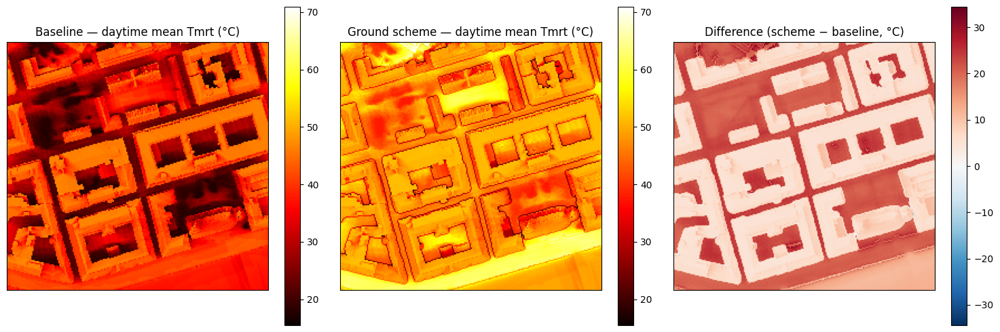
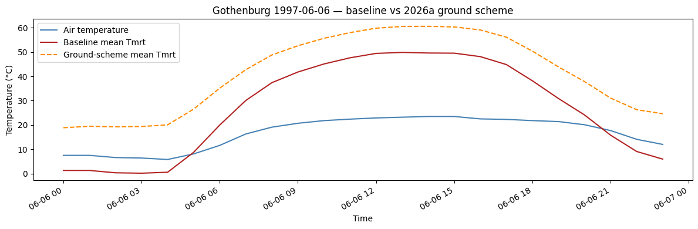

# UMEP 2026a Ground Scheme (experimental)

> This page is the rendered output of a Jupyter notebook that ships in the
> repository, together with all the data it uses. To run it yourself, see
> [Running the tutorials](index.md#running-the-tutorials-yourself).


SOLWEIG's baseline ground model parameterises surface temperature with a sinusoidal
diurnal wave. UMEP's 2026a generation introduces an alternative, prognostic scheme:
a force-restore surface temperature driven by the Objective Hysteresis Model
(Grimmond et al. 1991), with a slab model for water, plus a solid-angle view-factor
model for the outgoing longwave radiation. This library ports that scheme behind two
opt-in flags:

- `use_ground_scheme=True` — force-restore/OHM ground surface temperature
- `use_outgoing_longwave=True` — solid-angle outgoing longwave (currently required together)

**Status: experimental, off by default.** The port matches the upstream reference
implementation component by component, but a field comparison against measured Tmrt at
three Gothenburg sites shows the scheme as currently published runs substantially warmer
than observations (see `VALIDATION.md`, section "UMEP 2026a ground scheme"). A question
about the radiation composition is open with the upstream developers. Use the flags to
explore the scheme's behaviour, not for production Tmrt.

Requirements: a land-cover grid (classes 0/1/2/5/6/7), and the raster must fit in a
single tile (tiled processing is not yet supported with the scheme).


```python
from pathlib import Path

import matplotlib.pyplot as plt
import numpy as np
import solweig

# Resolve the repo root so this notebook runs from the repo root or docs/tutorials/
ROOT = next(p for p in [Path.cwd(), *Path.cwd().parents] if (p / "demos").exists())

DATA_DIR = ROOT / "demos/data/Goteborg_SWEREF99_1200"
WORK_DIR = ROOT / "temp/tutorial_cache/gbg"
WORK_DIR.mkdir(parents=True, exist_ok=True)

assert (DATA_DIR / "DSM_KRbig.tif").exists(), f"Demo data not found at {DATA_DIR.resolve()}"
```

## 1. Prepare the surface

The Gothenburg demo area (central Gothenburg, 1 m resolution) ships with a land-cover
grid — paved, buildings, grass, and water — which the ground scheme requires. Each
class gets its own heat capacity, thermal diffusivity, and OHM coefficients from the
bundled materials parameters.


```python
surface = solweig.SurfaceData.prepare(
    dsm=str(DATA_DIR / "DSM_KRbig.tif"),
    dem=str(DATA_DIR / "DEM_KRbig.tif"),
    cdsm=str(DATA_DIR / "CDSM_KRbig.tif"),
    land_cover=str(DATA_DIR / "landcover.tif"),
    working_dir=str(WORK_DIR / "working"),
)
print(f"Surface ready: {surface.dsm.shape}")
print(f"Land cover classes: {sorted(np.unique(surface.land_cover).tolist())}")
```

    solweig.models.surface: Preparing surface data from GeoTIFF files...


    solweig.io: No-data value is -3.4028234663852886e+38, replacing with NaN


    solweig.models.surface_loading:   DSM: 234×223 pixels


    solweig.models.surface_loading:   Extracted pixel size from DSM: 1.00 m


    solweig.models.surface_loading:   CRS validated: SWEREF99 12 00 (EPSG:3007)


    solweig.io: No-data value is -3.40282346638529e+38, replacing with NaN


    solweig.models.surface_loading:   ✓ Canopy DSM (CDSM) provided


    solweig.io: No-data value is -3.4028234663852886e+38, replacing with NaN


    solweig.models.surface_loading:   ✓ Ground elevation (DEM) provided


    solweig.models.surface_loading:   → No TDSM provided - will auto-generate from CDSM (ratio=0.25)


    solweig.io: No-data value is -9999.0, replacing with NaN


    solweig.models.surface_loading:   ✓ Land cover provided (albedo/emissivity derived from classification)


    solweig.models.surface_loading: Checking for preprocessing data...


    solweig.models.surface_loading:   → No walls found in working_dir - will compute from DSM and cache


    solweig.models.surface_loading:   → No SVF found in working_dir - will compute and cache


    solweig.models.surface_loading: Computing spatial extent and resolution...


    solweig.models.surface_loading:   Auto-computed extent from raster intersection: [147720.0, 6398557.0, 147954.0, 6398780.0]


    solweig.models.surface_loading:   ✓ No resampling needed - all rasters match target grid


    solweig.models.surface_loading:   Layers loaded: DSM, CDSM, DEM, land_cover


    solweig.models.surface: Raising 24560 DSM pixels to DEM (DSM was below terrain)


    solweig.models.surface: Flattened 1655 DSM pixels below 1.0m nDSM to DEM (removing sub-threshold features)


    solweig.models.surface: Auto-generating TDSM from CDSM using trunk_ratio=0.25


    solweig.models.surface: Converted relative CDSM to absolute (base: DEM)


    solweig.models.surface: Converted relative TDSM to absolute (base: DEM)


    solweig.models.surface: Cleared 2 vegetation pixels below DSM (canopy was underground)


    solweig.models.surface_compute: Computing walls from DSM and caching to working_dir...


    solweig.io: No-data value is -9999.0, replacing with NaN


    
Computing wall aspects:   0%|          | 0/180 [00:00<?, ?it/s]

    
Computing wall aspects: 100%|██████████| 180/180 [00:00<00:00, 1440791.45it/s]

    solweig.io: No-data value is -9999.0, replacing with NaN


    solweig.io: No-data value is -9999.0, replacing with NaN


    solweig.models.surface_compute:   ✓ Walls computed and cached to /Users/dev/repos/solweig/temp/tutorial_cache/gbg/working/walls/px1.000


    solweig.models.surface_compute: Computing SVF from DSM/CDSM/TDSM...


    
    [GPU] Shadow GPU context initialized successfully


    
Computing Sky View Factor:   0%|          | 0/153 [00:00<?, ?it/s]

    
Computing Sky View Factor:   5%|▌         | 8/153 [00:00<00:03, 36.33it/s]

    
Computing Sky View Factor:  20%|██        | 31/153 [00:00<00:01, 109.85it/s]

    
Computing Sky View Factor:  43%|████▎     | 66/153 [00:00<00:00, 190.76it/s]

    
Computing Sky View Factor:  97%|█████████▋| 149/153 [00:00<00:00, 294.49it/s]

    
Computing Sky View Factor: 100%|██████████| 153/153 [00:00<00:00, 228.81it/s]

    solweig.models.precomputed: Saved SVF memmap cache to /Users/dev/repos/solweig/temp/tutorial_cache/gbg/working/svf/px1.000/memmap (15 arrays)


    solweig.models.surface_serialization:   ✓ SVF saved as /Users/dev/repos/solweig/temp/tutorial_cache/gbg/working/svf/px1.000/svfs.zip (compressed)


    


    solweig.models.surface_serialization:   ✓ Shadow matrices saved as /Users/dev/repos/solweig/temp/tutorial_cache/gbg/working/svf/px1.000/shadowmats.npz (compressed)


    solweig.models.surface_compute:   ✓ SVF computed and cached to /Users/dev/repos/solweig/temp/tutorial_cache/gbg/working/svf/px1.000


    solweig.models.surface:   Valid mask: all pixels valid


    solweig.models.surface:   Crop: no trimming needed (valid bbox = full extent)


    solweig.models.surface:   Cleaned rasters saved to /Users/dev/repos/solweig/temp/tutorial_cache/gbg/working/cleaned


    solweig.models.surface: ✓ Surface data prepared successfully


    Surface ready: (223, 234)


    Land cover classes: [1, 2, 5, 7]


## 2. Weather: one summer day

The demo includes the classic Gothenburg 1997-06-06 met file used in the original
SOLWEIG publications.


```python
weather_list = solweig.Weather.from_umep_met(DATA_DIR / "gbg19970606_2015a.txt", resample_hourly=False)
location = solweig.Location(latitude=57.7, longitude=12.0, utc_offset=1)

print(f"{len(weather_list)} timesteps: {weather_list[0].datetime} → {weather_list[-1].datetime}")
```

    solweig.models.weather: Loaded 24 timesteps from UMEP met: 1997-06-06 00:00 → 1997-06-06 23:00


    24 timesteps: 1997-06-06 00:00:00 → 1997-06-06 23:00:00


## 3. Run baseline and scheme

Two identical runs; only the two flags differ. The scheme initialises its ground and
deep-soil temperatures from the first day's air temperature series and carries the
force-restore state (temperature and heat fluxes) between timesteps.


```python
summary_baseline = solweig.calculate(
    surface=surface,
    weather=weather_list,
    location=location,
    output_dir=str(WORK_DIR / "output_baseline"),
)

summary_scheme = solweig.calculate(
    surface=surface,
    weather=weather_list,
    location=location,
    output_dir=str(WORK_DIR / "output_scheme"),
    use_ground_scheme=True,
    use_outgoing_longwave=True,
)
```

    solweig.tiling: Resource-aware tile sizing (context=solweig): GPU budget=30,150,672,384 bytes, RAM=5,901,565,952 available of 51,539,607,552 total, max_tile_side=2714 px


    solweig.timeseries: ============================================================


    solweig.timeseries: Starting SOLWEIG timeseries calculation


    solweig.timeseries:   Grid size: 234x223 pixels


    solweig.timeseries:   Timesteps: 24


    solweig.timeseries:   Period: 1997-06-06 00:00 -> 1997-06-06 23:00


    solweig.timeseries:   Location: 57.70N, 12.00E


    solweig.timeseries: ============================================================


    solweig.timeseries: Pre-computing sun positions and radiation splits...


    solweig.timeseries:   Pre-computed 24 timesteps in 0.0s


    
SOLWEIG timeseries:   0%|          | 0/24 [00:00<?, ?it/s]

    [GPU] GVF GPU context initialized
    [GPU] Anisotropic sky GPU context initialized
    
SOLWEIG timeseries:   4%|▍         | 1/24 [00:00<00:04,  5.56it/s]

    
SOLWEIG timeseries:   8%|▊         | 2/24 [00:00<00:05,  3.71it/s]

    
SOLWEIG timeseries:  12%|█▎        | 3/24 [00:00<00:04,  4.91it/s]

    
SOLWEIG timeseries:  21%|██        | 5/24 [00:00<00:02,  7.63it/s]

    
SOLWEIG timeseries:  25%|██▌       | 6/24 [00:01<00:03,  4.90it/s]

    
SOLWEIG timeseries:  33%|███▎      | 8/24 [00:01<00:02,  6.41it/s]

    
SOLWEIG timeseries:  38%|███▊      | 9/24 [00:01<00:02,  5.95it/s]

    
SOLWEIG timeseries:  46%|████▌     | 11/24 [00:01<00:02,  6.48it/s]

    
SOLWEIG timeseries:  50%|█████     | 12/24 [00:02<00:02,  5.35it/s]

    
SOLWEIG timeseries:  58%|█████▊    | 14/24 [00:02<00:01,  5.32it/s]

    
SOLWEIG timeseries:  62%|██████▎   | 15/24 [00:02<00:01,  5.26it/s]

    
SOLWEIG timeseries:  67%|██████▋   | 16/24 [00:02<00:01,  5.49it/s]

    
SOLWEIG timeseries:  71%|███████   | 17/24 [00:03<00:01,  4.60it/s]

    
SOLWEIG timeseries:  79%|███████▉  | 19/24 [00:03<00:00,  6.08it/s]

    
SOLWEIG timeseries:  88%|████████▊ | 21/24 [00:03<00:00,  7.28it/s]

    
SOLWEIG timeseries:  92%|█████████▏| 22/24 [00:03<00:00,  5.26it/s]

    
SOLWEIG timeseries:  96%|█████████▌| 23/24 [00:04<00:00,  4.60it/s]

    
SOLWEIG timeseries: 100%|██████████| 24/24 [00:04<00:00,  4.94it/s]

    
SOLWEIG timeseries: 100%|██████████| 24/24 [00:04<00:00,  5.44it/s]

    solweig.timeseries: ============================================================


    solweig.timeseries: Calculation complete: 24 timesteps processed


    solweig.timeseries:   Total time: 4.4s (5.44 steps/s)


    solweig.timeseries: ============================================================


    


    solweig.timeseries: ============================================================


    solweig.timeseries: Starting SOLWEIG timeseries calculation


    solweig.timeseries:   Grid size: 234x223 pixels


    solweig.timeseries:   Timesteps: 24


    solweig.timeseries:   Period: 1997-06-06 00:00 -> 1997-06-06 23:00


    solweig.timeseries:   Location: 57.70N, 12.00E


    solweig.timeseries: ============================================================


    solweig.timeseries: Pre-computing sun positions and radiation splits...


    solweig.timeseries:   Pre-computed 24 timesteps in 0.0s


    
SOLWEIG timeseries:   0%|          | 0/24 [00:00<?, ?it/s]

    solweig.components.ground_scheme:   Ground scheme initialised: classes [1, 2, 5, 7], day 157


    
SOLWEIG timeseries:   4%|▍         | 1/24 [00:00<00:08,  2.62it/s]

    
SOLWEIG timeseries:   8%|▊         | 2/24 [00:00<00:06,  3.22it/s]

    
SOLWEIG timeseries:  17%|█▋        | 4/24 [00:00<00:03,  6.28it/s]

    
SOLWEIG timeseries:  25%|██▌       | 6/24 [00:00<00:02,  7.73it/s]

    
SOLWEIG timeseries:  33%|███▎      | 8/24 [00:01<00:02,  6.46it/s]

    
SOLWEIG timeseries:  42%|████▏     | 10/24 [00:01<00:01,  7.52it/s]

    
SOLWEIG timeseries:  50%|█████     | 12/24 [00:01<00:01,  8.41it/s]

    
SOLWEIG timeseries:  54%|█████▍    | 13/24 [00:01<00:01,  8.12it/s]

    
SOLWEIG timeseries:  58%|█████▊    | 14/24 [00:02<00:01,  7.00it/s]

    
SOLWEIG timeseries:  62%|██████▎   | 15/24 [00:02<00:01,  5.45it/s]

    
SOLWEIG timeseries:  67%|██████▋   | 16/24 [00:02<00:01,  4.95it/s]

    
SOLWEIG timeseries:  71%|███████   | 17/24 [00:02<00:01,  4.43it/s]

    
SOLWEIG timeseries:  75%|███████▌  | 18/24 [00:03<00:01,  3.92it/s]

    
SOLWEIG timeseries:  79%|███████▉  | 19/24 [00:03<00:01,  3.97it/s]

    
SOLWEIG timeseries:  83%|████████▎ | 20/24 [00:03<00:00,  4.37it/s]

    
SOLWEIG timeseries:  88%|████████▊ | 21/24 [00:03<00:00,  4.82it/s]

    
SOLWEIG timeseries:  92%|█████████▏| 22/24 [00:04<00:00,  4.58it/s]

    
SOLWEIG timeseries:  96%|█████████▌| 23/24 [00:04<00:00,  3.78it/s]

    
SOLWEIG timeseries: 100%|██████████| 24/24 [00:05<00:00,  2.81it/s]

    
SOLWEIG timeseries: 100%|██████████| 24/24 [00:05<00:00,  4.76it/s]

    solweig.timeseries: ============================================================


    solweig.timeseries: Calculation complete: 24 timesteps processed


    solweig.timeseries:   Total time: 5.0s (4.76 steps/s)


    solweig.timeseries: ============================================================


    


## 4. Compare the daytime mean Tmrt

The spatial pattern stays similar (shadows and sky view dominate), but the scheme
shifts the level upward — the warm bias documented in `VALIDATION.md`.


```python
fig, axes = plt.subplots(1, 3, figsize=(15, 5))

vmin = np.nanmin(summary_baseline.tmrt_day_mean)
vmax = np.nanmax(summary_scheme.tmrt_day_mean)

im0 = axes[0].imshow(summary_baseline.tmrt_day_mean, cmap="hot", vmin=vmin, vmax=vmax)
axes[0].set_title("Baseline — daytime mean Tmrt (°C)")
plt.colorbar(im0, ax=axes[0])

im1 = axes[1].imshow(summary_scheme.tmrt_day_mean, cmap="hot", vmin=vmin, vmax=vmax)
axes[1].set_title("Ground scheme — daytime mean Tmrt (°C)")
plt.colorbar(im1, ax=axes[1])

diff = summary_scheme.tmrt_day_mean - summary_baseline.tmrt_day_mean
im2 = axes[2].imshow(diff, cmap="RdBu_r", vmin=-np.nanmax(np.abs(diff)), vmax=np.nanmax(np.abs(diff)))
axes[2].set_title("Difference (scheme − baseline, °C)")
plt.colorbar(im2, ax=axes[2])

for ax in axes:
    ax.set_xticks([])
    ax.set_yticks([])
plt.tight_layout()
plt.show()
```


    

    


## 5. Diurnal comparison


```python
ts_b = summary_baseline.timeseries
ts_s = summary_scheme.timeseries

fig, ax = plt.subplots(figsize=(12, 4))
ax.plot(ts_b.datetime, ts_b.ta, label="Air temperature", color="steelblue")
ax.plot(ts_b.datetime, ts_b.tmrt_mean, label="Baseline mean Tmrt", color="firebrick")
ax.plot(ts_s.datetime, ts_s.tmrt_mean, label="Ground-scheme mean Tmrt", color="darkorange", linestyle="--")
ax.set_ylabel("Temperature (°C)")
ax.set_xlabel("Time")
ax.legend()
ax.set_title("Gothenburg 1997-06-06 — baseline vs 2026a ground scheme")
fig.autofmt_xdate()
plt.tight_layout()
plt.show()
```


    

    


## Interpretation and caveats

- The scheme changes the ground physics only: shadows, sky view factors, and shortwave
  are shared with the baseline, so the spatial structure is unchanged.
- The prognostic ground temperature removes the baseline's morning warm-up artefact and
  gives water bodies realistic thermal inertia (they warm slowly, stay warm after sunset).
- Against field measurements, however, the scheme currently overestimates Tmrt by
  roughly 12–21 °C (anisotropic sky) because of how the directional side longwave is
  composed into the radiation budget. Until that is resolved upstream, treat scheme
  output as qualitative.
- Details: `VALIDATION.md` (field comparison), the ground temperature spec
  (physics), and the settings guide (flag rules).

